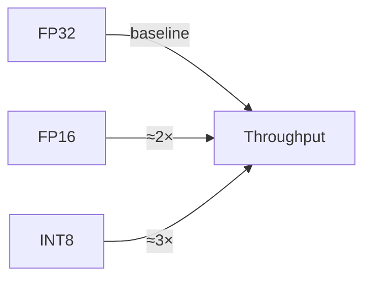
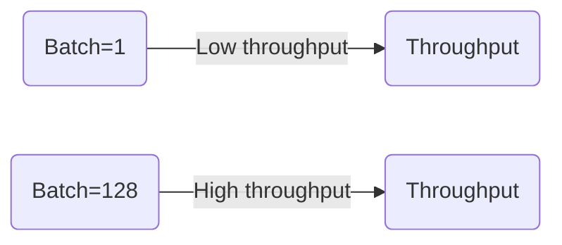
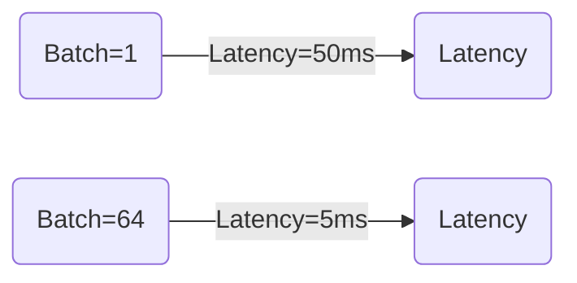
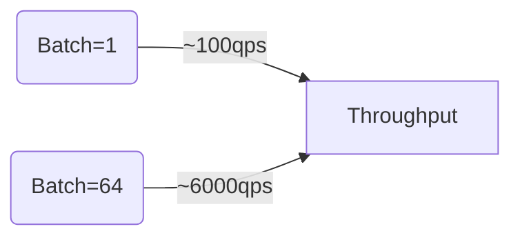
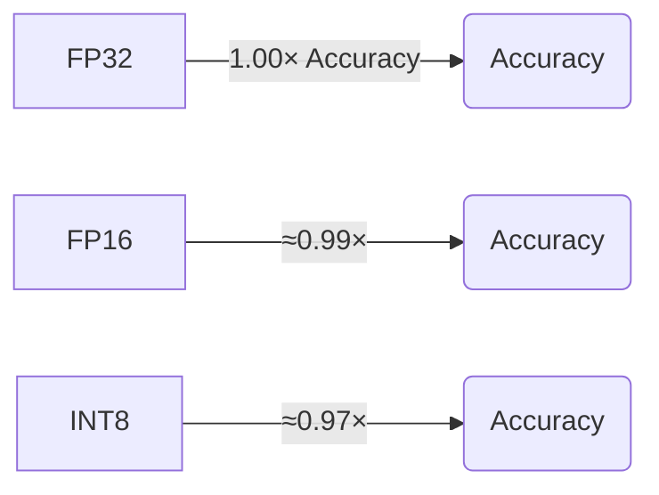

# Embedding Models with ILGPU (C#) vs ONNX: Feasibility Analysis

**Executive Summary:** Embedding models (word or sentence vectors, often from transformer encoders) are critical for semantic search. We examine replacing an ONNX-based embedding inference with a custom C# implementation using ILGPU. ILGPU is a .NET JIT compiler for GPU kernels【54†L34-L37】, enabling C# code to run on CUDA/OpenCL GPUs with high performance. ONNX Runtime, by contrast, uses optimized kernels (cuDNN, TensorRT) for inference【38†L231-L234】【15†L53-L62】. Key trade-offs include development effort versus performance. A fully custom ILGPU solution offers tight integration and potential for tailored optimizations, but requires re-implementing or mapping operators, careful memory and precision management, and extensive testing. A hybrid approach (using ONNX Runtime for some ops and custom ILGPU kernels for others) may balance effort and speed. We consider model types (word, sentence, transformer encoders), ONNX operator usage (e.g. *Gather*, *Gemm/MatMul*, *Softmax*, *LayerNorm* etc.)【22†L416-L423】【22†L427-L434】【26†L2442-L2444】, numeric precision (FP32/FP16/INT8)【15†L53-L62】【13†L384-L392】, memory layouts, batching, multi-GPU streaming, training vs inference, quantization, tooling, benchmarking, deployment, and maintenance. We provide recommended design patterns, C#/ILGPU pseudocode examples, performance charts (via Mermaid), and a phased implementation plan with effort estimates.  

## Embedding Model Types
- **Word Embeddings (Lookup Tables):** Classic models (Word2Vec, GloVe) map tokens to fixed vectors via a lookup (ONNX *Gather* operator)【22†L416-L423】. ILGPU can implement this by indexing into a contiguous embedding matrix. Simple pooling (e.g. averaging) can yield sentence embeddings for short texts.  
- **Sentence Embeddings (Shallow Models):** Non-transformer models (e.g. doc2vec, or average of word vectors) produce sentence vectors directly. These use basic ops (*Gemm*, *Add*, *Mean*) and minimal context dependency. ILGPU kernels would mainly do linear algebra and reductions.  
- **Transformer-based Embeddings:** Modern semantic search uses transformers (e.g. BERT/SBERT, MiniLM) to encode context. These involve multi-head attention (matmuls, *Softmax*, *Add*, *LayerNorm*, *GELU/ReLU* activations) and often two separate encoders for query and document (bi-encoder)【53†L110-L118】【41†L549-L553】. ONNX exporter converts the transformer to a graph of standard ops. ILGPU would need to implement these kernels or call cuBLAS/cuDNN routines via ILGPU.Algorithms. Transformers yield high-quality embeddings but are heavier to implement.  

For semantic search, models like SentenceTransformer (e.g. **all-MiniLM-L6-v2**, ~22M parameters) are typical【27†L28-L33】【53†L79-L88】. They take tokenized input, run through encoder(s), and apply mean-pooling + normalization as post-processing. (ONNX pipeline docs emphasize that tokenization and post-processing are usually done outside the core model【27†L23-L26】.) In summary, simpler embedding schemes (lookup + average) are easiest to implement in ILGPU, while full transformer encoders require substantial work but are feasible given ILGPU’s support for complex kernels【54†L72-L76】【51†L206-L209】.

## ONNX Model & Operator Set
ONNX embedding models combine pre-/post-processing with a core encoder graph. A typical pipeline (e.g. HuggingFace → ONNX) handles tokenization externally【27†L23-L26】, then the ONNX graph itself implements the encoder. Common ONNX operators in embedding models include:

- **Gather (Embedding Lookup):** Selects rows from an embedding matrix given input token IDs【22†L416-L423】.  
- **Gemm/MatMul:** Dense linear layers for projections (e.g. input embeddings to hidden space, query/key/value linear maps). ONNX’s *Gemm* covers matrix multiply + bias【22†L427-L434】 (MatMul without bias is also used).  
- **Add/Bias:** Bias addition, residual sums.  
- **Softmax:** In attention, to convert logits to weights【26†L2442-L2444】.  
- **LayerNormalization:** Normalizes vectors (commonly after attention or MLP blocks). (ONNX has a *LayerNormalization* operator available.)  
- **Activation Functions:** GELU, ReLU, etc. ONNX defines *Gelu*, *Relu*, etc.  
- **Reshape/Transpose/Concat:** Tensor reshaping for heads, sequence pooling, etc.  
- **Pool/Reduction (Mean):** To aggregate token embeddings (mean-pooling) or in global pool layers.  
- **Optional Extra:** Some models use *CosineSimilarity* (for scoring) or token type embeddings. ONNX also supports fused attention (*Attention* op) in newer versions【20†L78-L80】, though exporters often expand this to primitives.

These operators form the bulk of the model. ILGPU would either implement each needed op as a GPU kernel or leverage ILGPU.Algorithms (which provides BLAS/GEMM, possibly reductions, etc.). For example, an ILGPU kernel can load one row of an embedding table per thread for *Gather*, or call cuBLAS (via ILGPU.Algorithms) for *Gemm*. (ONNX’s operator registry confirms versions for *Gather*, *Gemm*, *Softmax* etc.【22†L416-L424】【26†L2442-L2444】.)  

## Numerical Precision (FP32/FP16/INT8)
Precision is key for performance vs accuracy. ONNX Runtime (ORT) by default runs in FP32, but can use lower precision. NVIDIA’s ONNX Execution Providers exploit tensor cores: for Ampere GPUs they use NHWC layouts and FP16/FP8 compute【15†L53-L62】. Specifically, ORT’s CUDA EP uses cuDNN with tensor cores (FP16/FP8), and TensorRT EP can further optimize (INT8)【15†L53-L62】. ILGPU supports FP32 natively; it also allows half-precision (FP16) kernels (assuming hardware support) and integer types. However, ILGPU does not automatically optimize to Tensor Cores – one must explicitly use FP16 in code. 

**Quantization:** ORT supports static and dynamic quantization in ONNX graphs, but with caveats. ORT docs note that quantization *is not lossless*【13†L322-L330】: post-training quantization (PTQ) can reduce model size and inference cost but may degrade accuracy. For transformer-based models, ORT recommends *dynamic quantization* (weight+activation quant at runtime) rather than static calibration for CNNs【13†L384-L392】. Also, on GPUs ORT only supports *symmetric INT8* (S8S8) in limited cases (e.g. Gemm)【13†L401-L405】, whereas CPU EP supports more schemes. ILGPU implementations could potentially use INT8 matrix multiply if one implements scaling manually, but this is advanced. 

In practice, FP16 is a common compromise: many embeddings models retain accuracy in half precision, doubling throughput. For example, NVIDIA notes FP16 and even FP8 support for faster inference【15†L53-L62】. ILGPU kernels written in C# can use `Half` (System.Half) or custom FP16, but verification is needed. INT8 yields higher throughput (and is often hardware-accelerated via tensort cores on GPU), but requires calibration of scales and careful validation of semantic accuracy. 

**Mermaid Chart – Throughput vs Precision:** Lower precision generally yields higher throughput. For illustration:


*(Conceptual chart: FP16 or INT8 often achieve higher inference throughput than FP32.)*

## Memory Layout & Batching
Embedding models typically use contiguous tensors for weights and data. For example, a lookup table is stored as a 2D array `[vocab_size × embed_dim]`, row-major. Matrices in ILGPU should be laid out to maximize coalesced access (e.g. thread blocks read contiguous memory). Batched inputs (e.g. `batch×seq_len` token IDs) are common for throughput. Effective batching strategies:

- **Batch Size:** Larger batches amortize kernel launch overhead and saturate GPU; small batches (e.g. real-time single query) yield low utilization. Throughput (embeddings/s) usually rises with batch size up to hardware limits【15†L53-L62】.  
- **Sequence Packing:** Pad sequences to uniform length within a batch. On GPU, fixed-size matrices are efficient; ragged sequences require masking.  
- **Memory Buffers:** Use large `ILGPU.MemoryBuffer<T>` or `ILGPU.ArrayView<T>` for weights and inputs. The embedding table might reside in constant or global memory on GPU. Intermediate tensors (e.g. hidden states) are allocated per batch.  
- **Pooled Layouts:** After per-token encoding, a reduction (mean or CLS-token selection) aggregates the sequence. This can be done by ILGPU kernels doing a parallel sum/mean across the seq dimension.

No special ONNX requirement here beyond standard tensor storage. But ILGPU gives direct control: e.g. one can pin CPU memory (page-lock) so the same host array can be accessed by GPU without extra copy. ILGPU’s `Allocate1D<T>` can allocate page-locked buffers. For zero-copy, ILGPU even supports creating device pointers to pinned host memory (via `CreatePageLockFromPinned`) so that the GPU kernel reads host data directly, though performance varies. In practice, mixing asynchronous copies with compute is effective.

**Data Transfer & Zero-Copy:** A known ILGPU pattern is overlapping host<->device copies with kernel execution. In one ILGPU example, separate CUDA streams are used for copy and compute; using `CopyFromCPUUnsafeAsync` on a custom stream allowed copying input while a previous batch was processed. This achieved nearly 100% overlap (total time ≈ max of compute time and copy time)【31†L342-L350】【31†L362-L370】. In contrast, synchronous copies serialized the steps. Therefore, use multiple streams (e.g. default for compute, one stream for each batch’s copy) and page-locked memory. ONNX Runtime also manages transfers internally (CUDA EP can use pinned memory for zero-copy), but ILGPU lets you explicitly schedule them.


*(Throughput typically grows with batch size.)*

## GPU Kernel Mapping
To replace ONNX with ILGPU, each relevant op must map to one or more GPU kernels or library calls:

- **Embedding Lookup (Gather):** Kernel where each thread reads `table[token_id]` into the output. In ILGPU: use an index kernel that loads embedding vectors from a weight buffer.  
- **Matrix Multiply (Gemm/MatMul):** Use ILGPU.Algorithms or write a tiled matmul kernel. ILGPU.Algorithms provides a C# wrapper for cuBLAS (`CuBlas.Gemm`)【31†L302-L310】 or pure C# kernels. For transformer attention (Q×Kᵀ), this is critical.  
- **Bias/Add and Activations:** Elementwise operations map to trivial ILGPU kernels (one thread per element doing `C[i]=A[i]+B[i]` or `max(0,A[i])`).  
- **Softmax:** Often implemented as two-stage (exp + sum + div). ILGPU example: launch kernel to exponentiate and reduce (sum) then another to divide. Alternatively use thrust-like reductions in ILGPU.  
- **LayerNorm:** Compute mean and variance (reductions) then apply `(x-mean)/sqrt(var+ε)*gamma + beta`. ILGPU can do these in one or two passes (parallel reduction and broadcast).  
- **Reshape/Transpose:** No computation; reinterpret strides or copy. ILGPU doesn’t need special ops; you manage views/indices.  
- **Concat/Gather (for batching):** E.g. stacking sequence embeddings. ILGPU can copy blocks of memory or index accordingly.

ILGPU also supports warp-level and shared-memory optimizations, but implementing high-performance fused kernels (e.g. fused QKV or FMa kernels) is complex. A pragmatic approach: identify the heaviest ops (matmuls, large elementwise) and ensure they use optimized routines. For instance, use `CuBlas.Gemm()` for all large matrix multiplies, and write custom ILGPU kernels only for the simple ops around them. Table lookup and normalization have comparatively low computational intensity and can be direct kernels.  

Example pseudocode snippet for an embedding lookup kernel: 
```csharp
// Kernel: each thread processes one token position of one sequence
static void EmbedKernel(
    Index2 idx,              // (batch, seq_pos)
    ArrayView<int> tokens,   // input token IDs [batch*seq_len]
    ArrayView<float> table,  // embedding table [vocab * emb_dim]
    int vocabSize, int embDim,
    ArrayView<float> output) // output embeddings [batch*seq_len*emb_dim]
{
    int batch = idx.X, pos = idx.Y;
    int tokenId = tokens[batch * SeqLen + pos];
    for (int d = 0; d < embDim; d++)
    {
        // each thread reads one element of the embedding row
        output[(batch * SeqLen + pos) * embDim + d] = table[tokenId * embDim + d];
    }
}
```
This can be launched with `(batch, SeqLen)` grid dimensions. Similar kernels would be written for other elementwise ops. For matmuls, one can bind CUBLAS as shown in ILGPU docs and GitHub issues【31†L302-L310】. 

## Multi-GPU & Streaming
ILGPU supports multiple accelerators (CPUs, CUDA GPUs, OpenCL) in one context. You can query devices via `context.GetCudaDevices()` and create a `CudaAccelerator` per GPU【31†L302-L310】. Each accelerator has independent streams. For example, one thread can bind to GPU0 and another to GPU1 simultaneously. ILGPU allows creating streams (`accelerator.CreateStream()`) to overlap tasks. In the example above, two CUDA P100 GPUs were used with parallel kernels and asynchronous copies【31†L298-L307】【31†L342-L350】. 

To scale to multi-GPU:
- Split batches across GPUs. Use separate ILGPU accelerator objects and launch kernels independently. 
- Overlap copies on each GPU using streams (as above). 
- Aggregate results on host if needed (e.g. gather embeddings). 
- Be careful with CPU->GPU transfers: either split data for each GPU or use CUDA Unified Memory / Remote Direct Memory Access (RDMA) if available. ILGPU does not automatically shard across GPUs, so the code must distribute. 

Streaming (concurrent compute + copy) was demonstrated in [31]. Without explicit sync, ILGPU correctly overlapped compute on one stream with copy on another, maximizing throughput【31†L342-L350】【31†L362-L370】. 

## Training vs Inference
Our focus is on **inference** for semantic search embeddings. ILGPU is optimized for inference-like kernels. For **training**, one would need to implement backprop (gradients) for each operator – a major undertaking. ONNX Runtime does not support training (it’s inference-only); ONNX’s “training” is offline in frameworks like PyTorch【13†L387-L390】. (ORT has experimental training for large models, but that’s outside typical use.) In practice, if embeddings need retraining or fine-tuning, one would continue using PyTorch/TF and then export the updated model to ONNX. 

Therefore, assume **inference only**: ILGPU will not handle weight updates, but can compute forward embeddings. This sidesteps issues of auto-differentiation and simplifies design. Just use the trained weights in GPU buffers. ORT likewise loads a fixed ONNX graph for inference. 

## Quantization & Accuracy Tradeoffs
Quantization can greatly reduce model size and inference cost. As noted, ONNX dynamic quantization is recommended for transformer models【13†L384-L392】. ILGPU implementations could also use quantized weights: e.g. store int8 tables and cast inputs. However, quantization can harm semantic accuracy if not calibrated. This trade-off must be evaluated: e.g. does FP16 or INT8 embedding reduce retrieval performance? The trade-offs table might include:

- **FP32 (baseline):** Full accuracy, highest memory usage, lower throughput.  
- **FP16:** ~2× throughput (half the memory). Many transformer models lose <1% accuracy on embeddings in FP16.  
- **INT8:** Up to ~3× throughput (quarter memory). Requires careful scale factors and may need per-channel calibration. Could degrade embedding similarity more noticeably. 

In any case, thorough benchmarking is needed. ONNX Runtime provides tools to debug quantization errors (comparing layer activations between FP32 and quantized runs)【13†L322-L330】. A similar approach should be used for ILGPU: compare ILGPU outputs (FP32 vs quantized) against a reference (e.g. original ONNX/CPU) across sample data. 

## Tooling and Debugging
**ILGPU Tools:** ILGPU offers strong debugging support. Kernels can run on a **CPU Accelerator** (a .NET multi-threaded simulator)【54†L72-L76】【51†L206-L209】. This means you can debug your GPU code as C# on the host. The official docs emphasize using CPU mode for debugging: *“the CPUAccelerator is best for debugging and as a fallback… it is the only way to use much of the debugging features built into C#”*【51†L206-L209】. In practice, you can set `Context` to include a `CPUAccelerator`, run kernels there (very slow, but fully debuggable), step through code, inspect variables, etc. This makes kernel development and troubleshooting easier than if writing raw CUDA C++.  

ILGPU also has profiling integration (e.g. NVIDIA Nsight) and some built-in statistics. For example, `Accelerator.ReportStatistics()` can log occupancy and timing. ILGPU  documentation notes support for hardware debugging via CUDA debuggers, but recommends CPU-based debugging for ease【54†L72-L76】. 

**ONNX/ORT Tools:** ONNX Runtime has profiling, logging, and a .NET API. You can enable verbose logging on CUDA EP, or use tools like Nsight to inspect kernel usage. ONNX runtime’s graph optimizations may complicate debugging; fortunately, ORT can export optimized graph or turn off fusions. The ORT docs note it “applies a number of graph optimizations” and partitions workloads to accelerators【38†L231-L234】; for debugging accuracy, one can run the model on CPU and GPU and compare outputs layer-by-layer.  

## Performance Benchmarking
A rigorous benchmark should measure both **latency** (time per query/batch) and **throughput** (queries per second). Metrics include: average and tail latency (percentiles), and throughput at various batch sizes. One should compare ILGPU vs ONNX under identical conditions (same hardware, same model weights). Use a mix of batch sizes: small (N=1) to test real-time latency, and large (N=64,128) to test throughput scaling. Also measure GPU utilization and memory bandwidth (NVIDIA tools like `nvidia-smi dmon` or Nsight Systems can help). 

For quality, use standardized datasets: e.g. BEIR benchmarks (like TREC-COVID) or MTEB for retrieval accuracy【53†L37-L40】. These provide queries and corpora with relevance labels. Compute embeddings with both ILGPU and ONNX for queries and corpora, run nearest-neighbor search (e.g. using FAISS or a library), and compare metrics like MRR or recall. BEIR TREC-COVID has been used for “RAG-style” search benchmarking【53†L37-L40】. Synthetic tests (random vectors) can check compute correctness and throughput without I/O overhead. 

Measure precision trade-offs by running FP32 vs FP16 vs INT8. ONNX results for each mode can be a baseline. Use confidence intervals or repeated runs for stability. Document the test environment: GPU model, driver, ILGPU version, etc. Since ILGPU is JIT, include a warm-up iteration in each test. 

Use standard metrics tables or plots. For example, plot throughput vs batch size for each method and precision; latency vs batch. The guidelines suggest charts (Mermaid):

*(Sample conceptual chart: large batches reduce per-item latency.)*

**Mermaid Chart – Batch vs Throughput:** (conceptual)

*(Hypothetical: throughput rises with batch.)*

## Deployment & Packaging
A C# ILGPU embedding solution can be packaged as a .NET assembly (DLL or NuGet). It needs the ILGPU runtime (ILGPU, ILGPU.Algorithms, ILGPU.Runtime.Cuda) which are .NET libraries. No special hardware dependencies beyond CUDA drivers. The whole model (weight tensors) can be embedded as resource files or loaded at runtime (e.g. from files or hard-coded arrays). This contrasts with ONNX, where one typically ships the `.onnx` model file and a host (e.g. C#) using Microsoft.ML.OnnxRuntime NuGet and its native binaries (ORT libraries, potentially CUDA EP). 

ILGPU code runs where the .NET runtime can access the GPU (Windows, Linux). Model updates imply recompiling or loading new weight buffers. There is no intermediate graph format: C# code is the “inference engine”. That can simplify CI/CD (no separate ONNX file to version). However, one must ensure compatibility of ILGPU versions with target GPU (although ILGPU supports many NVIDIA GPUs by CUDA). ILGPU’s MIT/NCSA license allows free use, whereas ONNX Runtime is Apache-2.0 licensed. 

## Maintenance
Maintaining a custom ILGPU inference engine means handling future changes in two areas: the embedding model architecture and the ILGPU platform. If the model evolves (e.g. new layers), one must update the ILGPU kernels. In contrast, ONNX provides a stable abstraction: new models can be exported to ONNX with minimal code change in the consumer. ILGPU dependencies will evolve (e.g. ILGPU 2.0 vs 3.0 breaking changes), so pin versions and test accordingly. Good test coverage (unit tests comparing ILGPU vs a known correct baseline) will catch regressions. The table below outlines high-level risk categories:

| **Risk**                          | **Impact**                             | **Mitigation**                                       |
|-----------------------------------|----------------------------------------|------------------------------------------------------|
| **Implementation Complexity**      | High development effort; bugs         | Prototype incrementally (start with lookup+MatMul); use ILGPU CPU debug【51†L206-L209】 |
| **Performance Uncertainty**       | Risk of slower-than-ORT performance   | Profile with Nsight; use ILGPU.Algorithms (cuBLAS) for heavy ops; tune launch configs |
| **Accuracy Loss (Quantization)**  | Reduced semantic accuracy            | Validate embeddings (e.g. cosine similarity) after quantization; use ONNX tools【13†L322-L330】 |
| **Hardware Compatibility**        | New GPU architectures or drivers     | Test on target GPUs; ILGPU supports CUDA GPUs broadly【15†L53-L62】; fall back to CPU mode if needed |
| **Maintenance Burden**            | Ongoing updates vs ONNX model changes | Keep ILGPU kernels modular; consider hybrid (reuse ORT for some parts) |
| **Debugging Difficulty**          | Hard-to-find errors in GPU kernels   | Leverage CPU mode and unit tests; instrument ILGPU kernels with debug flags; compare to ONNX outputs |

## Architecture & Code Structure
A recommended architecture separates concerns:

- **Preprocessing:** On CPU. Tokenize input text (using a tokenizer library), map to IDs. (This could be done in C#, or reused code from ONNX pipeline.)  
- **GPU Kernels (ILGPU):**  
  - Load model weights (embeddings matrix, transformer weights) into `MemoryBuffer<T>`.  
  - Define kernels for each stage: e.g. `EmbedKernel`, `TransformerBlockKernel`, `PoolKernel`. Load them with `LoadAutoGroupedStreamKernel` or build manually.  
  - Launch kernels in sequence (or fusion where possible), chaining data via GPU buffers.  
  - Example C# pseudocode:
    ```csharp
    using var ctx = Context.CreateDefault();                   // ILGPU context
    using var acc = ctx.GetCudaAccelerator(0);                // Select GPU
    var embedTableBuf = acc.Allocate1D<float>(vocabSize * embDim);
    var transformerWeightsBuf = acc.Allocate1D<float>(...);
    // ... load data into buffers ...
    var embedKernel = acc.LoadAutoGroupedStreamKernel<Index2, ArrayView<int>, ArrayView<float>, ArrayView<float>>(EmbedKernel);
    // Launch: batch x seq_len threads
    embedKernel((batchSize, seqLen), inputIdsView, embedTableBuf.View, embeddingOutputBuf.View);
    // Then launch transformer kernels...
    ```
  - Use ILGPU streams to overlap kernel launches and copies.  
- **Postprocessing:** Copy final embeddings back to CPU (`ToArray()` on output buffer). Optionally normalize vectors or apply custom steps (like scaling).  

Each stage should be modular. For example, implement a `TransformerLayer` function (or kernel) that does one block (or fuse QKV+Softmax+projection). These can be C# generics with `Index3` grids (batch, head, position).  

For debugging, write your ILGPU code so it can run on a CPUAccelerator (e.g. `context.CPUAccelerator`). Then step through it in Visual Studio as normal C# for small inputs【51†L206-L209】【54†L72-L76】.

## Implementation Plan
A phased approach (effort estimates, assuming a small dev team):

1. **Prototype Basic Embedding** – *2–4 weeks:* Implement a simple lookup or shallow model (e.g. average word embeddings). Measure performance.  
2. **Linear Layers & Pooling** – *1–2 weeks:* Add support for a few dense layers, pooling ops (to replicate e.g. a tiny MLP). Benchmark against ONNX.  
3. **Transformer Block(s)** – *3–5 weeks:* Implement one transformer encoder block (attention + feed-forward) for small sequences. Use ILGPU.Algorithms (cuBLAS) for matmuls. Verify outputs match ONNX for known inputs.  
4. **Full Model Integration** – *4–6 weeks:* Extend to complete embedding model (all layers). Profile to find hotspots. Use streams to overlap copy/compute.  
5. **Precision & Quantization** – *2–3 weeks:* Implement FP16 versions; experiment with int8 weights. Validate accuracy drop.  
6. **Multi-GPU & Streaming** – *2–3 weeks:* Enable splitting batches across GPUs, overlapping transfers. Test scaling with 2+ GPUs.  
7. **Testing & Optimization** – *3–4 weeks:* Build unit tests against ONNX (compare embeddings). Optimize kernels (adjust block sizes, use shared memory).  
8. **Benchmarking Suite** – *1–2 weeks:* Setup automated benchmarks (latency/throughput tests with synthetic and real data, e.g. BEIR).  
9. **Deployment & Packaging** – *1–2 weeks:* Create NuGet/assembly packaging, example app integration.  
10. **Monitoring & Maintenance Setup** – *1 week:* Documentation, CI integration (e.g. run inference tests on PRs).  

Total: ~19–30 weeks (5–8 months), depending on team size and parallel work. These estimates are rough. A hybrid approach (e.g. using ONNX runtime for some layers) could cut some effort but adds integration complexity.

## Approaches Comparison

| **Approach**                  | **Description**                                 | **Pros**                               | **Cons**                                  |
|-------------------------------|-------------------------------------------------|----------------------------------------|-------------------------------------------|
| **Full ILGPU Reimplementation** | Write all embedding ops as ILGPU kernels in C#.    | Full control over execution; avoids ONNX Runtime overhead; seamless C# integration【54†L34-L37】.  | Very high development effort; risk of subtle bugs; must re-implement and optimize many ops. |
| **Hybrid (ONNX + ILGPU)**     | Use ONNX Runtime for parts (e.g. attention) and ILGPU for others (e.g. custom pooling or quantized matmul). | Leverage ONNX’s optimized kernels for heavy ops; less code to write; gradual transition. | Complexity in mixing runtimes; data conversion overhead between ORT and ILGPU; licensing/runtime dependencies on ONNX and ILGPU. |
| **ONNX Runtime Baseline**     | Use existing ONNX model and ONNX Runtime (CUDA/TensorRT EP) as is. | Mature, optimized; minimal dev effort; support for many platforms; dynamic graph optimizations【38†L231-L234】. | Limited flexibility (can’t easily change architecture); binary model format; might not max out hardware if not tuned. |

(Entries like “ease of debugging” and “compatibility” factor into pros/cons.)

## Risk & Mitigation

| **Risk**                              | **Mitigation**                                                                              |
|---------------------------------------|---------------------------------------------------------------------------------------------|
| **Incorrect Implementation**          | Validate ILGPU outputs against ONNX for random inputs. Unit tests for each kernel. Use CPU debugging【51†L206-L209】. |
| **Performance Shortfall**             | Profile early; use ILGPU.Algorithms (cuBLAS) for matmuls. Optimize memory access. Measure against ONNX baseline. |
| **Precision Mismatch**                | Compare embeddings with baseline on a test set. Allow mixed precision (maintain FP32 where needed). |
| **Long Development Time**             | Prioritize critical kernels; consider hybrid fallback. Reuse existing libraries (e.g. ONNX for some parts). |
| **Hardware Limitations**              | Test on target GPUs; ensure compute capability meets requirements. Fallback to CPU mode if needed. |
| **Maintenance Overhead**              | Document architecture; keep modular code; potentially train contributors on ILGPU. |

## Benchmarks and Datasets
**Suggested Benchmarks:**  
- **Quality:** BEIR (e.g. TREC-COVID) or MTEB tasks to measure retrieval metrics (NDCG, MRR). HuggingFace provides ONNX-exported models (e.g. all-MiniLM) for these tasks【27†L28-L33】【53†L37-L40】.  
- **Synthetic Data:** Random token sequences to stress-test throughput (no semantic meaning needed).  
- **Performance:** Measure latency (ms) and throughput (queries/s) for batch sizes {1, 8, 32, 128}. Metrics: median, 95%-tile latency; max achievable throughput. Track GPU utilization (nvidia-smi).  
- **Precision Tests:** Run full pipeline with FP32 vs FP16 vs INT8 (if implemented) and report any change in retrieval quality.  
- **Comparisons:** Include existing pipelines (e.g. ONNX Runtime with CUDA/TensorRT EP, and possibly CPU) as baselines.

**Example Chart (Precision Impact):**  

*(Illustrative: lower precision may slightly reduce accuracy; actual values must be measured.)*

**Datasets:** Use sentence pair or question-answer corpora. For instance, SemEval or MS MARCO Q&A for semantic similarity. For volume, GLUE or SNLI for sentence embeddings (though those measure classification on top of embeddings). The BEIR benchmark provides pre-defined corpora and queries with relevance labels, suited for semantic retrieval evaluation【53†L37-L40】.

## References

The analysis above draws on ILGPU documentation and community examples【54†L34-L37】【51†L206-L209】, ONNX and ONNX Runtime documentation【22†L416-L423】【26†L2442-L2444】【13†L322-L330】, and industry benchmarks【15†L53-L62】【53†L37-L40】, as well as practical insights from users【11†L177-L184】【31†L342-L350】. These sources inform the discussion of GPU programming patterns, operator coverage, precision modes, and performance strategies for embedding models.